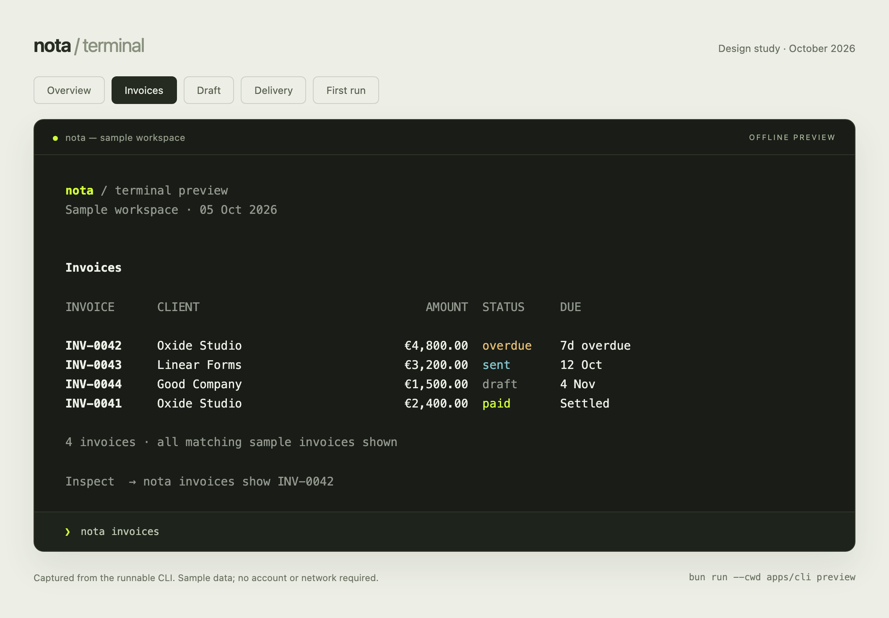

# Nota, in the terminal

Design proposal and runnable preview · 5 October 2026

**Implementation update:** browser OAuth and CLI 0.1.0 are now live. The local 0.2.0 source ports a denser variant into real commands: compact lists, a recent-invoices home, JSON/no-input output, pagination, and mutation review. The historical fixture preview below keeps its original airy layout. Account-wide overview totals and the wider command expansion remain future work.

**Recommendation:** build on the existing TypeScript CLI. Make the ordinary invoice workflow feel immediate: see what needs attention, create a draft, review it, send it, record payment. Use a restrained terminal identity, strong defaults, and complete scriptability.

## Try the design

From the repository root:

```sh
bun run --cwd apps/cli preview
bun run --cwd apps/cli preview tour
bun run --cwd apps/cli preview invoices create
bun run --cwd apps/cli preview invoices send INV-0044
bun run --cwd apps/cli preview invoices --status overdue --json
bun run --cwd apps/cli preview tour --width 40
```

The preview runs real Commander commands and Inquirer prompts against in-memory fixtures. It never imports credentials or the API client. Creation and sending are explicitly simulated; nothing persists between commands. Dates are fixed to 5 October 2026. The preview demonstrates EUR and 0% tax; that is a sample choice, not a product restriction.

[Open the captured visual preview](nota-cli-preview.html). Its tabs show actual renderer output; use the terminal to judge the interactions. Regenerate the HTML with `node apps/cli/design/capture.mjs`.



## What exists already

`apps/cli` has API-key login, identity/configuration, client lookup and creation, CSV import with preview hashes, invoice lookup and creation, send, mark paid, duplicate, and PDF download. Natural line-item input already works, including `Development, 40hrs at 120`.

The stack is TypeScript, Commander 14, Inquirer 8, Chalk 5, and `@nota-app/sdk`, in a Bun workspace. The deployed binary entry point is Node ESM. The SDK also exposes operations that the CLI does not yet expose, including partial payments, reminders, cancellation, credit notes, due-date changes, and XRechnung downloads.

The existing CLI's main weaknesses are experience and consistency: generic help as the landing screen, thin output hierarchy, no common JSON mode, no intentional narrow-terminal layout, and incomplete noninteractive behavior. Sending currently executes directly; the preview proposes a review step.

**This work adds a separate design preview, tests, and documentation. It does not replace or change live invoice commands.**

## The experience

### A useful front door

`nota` should answer “what needs my attention?” in one small screen. Show the current workspace, outstanding balances, overdue balances, draft count, and one concrete next action. The user can copy commands straight from the output. The normal entry point should print and exit; a persistent full-screen interface is unnecessary for this workflow.

The preview uses €6,800 outstanding: one €4,800 overdue invoice plus €2,000 remaining on a partially paid €3,200 invoice. Drafts are excluded. Overdue is a subset of outstanding. A live implementation must group totals by currency and obtain complete, server-calculated totals; adding the first page of invoices would be misleading.

First use has a different screen: a short explanation and `nota login`. The current API-key login remains the initial implementation. Browser/device authorization is a later backend project; a browser animation would not make that authentication exist.

### An invoice reads like an invoice

Lead with its number and state, then client, recipient, dates, items, tax, total, and remaining balance. Distinguish partially paid from fully settled. Keep internal notes explicitly labeled. Preserve invoice numbers and complete amounts; shorten long names only in wide tables, with the detail view providing the full value.

Use a borderless ledger with aligned monetary columns. Below the table threshold, stack records vertically instead of hiding columns or requiring horizontal scrolling. Text labels carry meaning without color. In the production renderer, show a year when a date falls outside the current year.

### Creation is a short conversation

`nota invoices create` asks for the client, then natural line items, then shows a review. Suggest the client's currency and payment terms, and make tax and due date visible. “Save draft” must be distinct from “send”. Defaults reduce typing but never hide the financial result.

The same task has a direct path:

```sh
nota invoices create \
  --client "Oxide Studio" \
  --item "Development, 40hrs at 120" \
  --item "Discovery | 1 | 800" \
  --yes
```

The preview lets you select a client, add multiple items, validate input, review, accept, decline, or cancel. Production should use an asynchronous searchable client picker, including an explicit create-client branch, and should render authoritative server totals before any delivery action. The preview's bounded integer-cent arithmetic is not a replacement for the invoice service.

### Delivery gets an explicit review

`nota invoices send INV-0044` displays workspace, recipient, total, attachment, and delivery effect before confirming, with “no” as the default. `--dry-run` shows this review without a mutation; `--yes` supplies explicit approval for automation. The preview exercises these last two flags and confirmation, but its recipient and attachment are fixtures.

For production, obtain the real recipient and filename from the server, preserve server warnings, and accurately distinguish queued email from delivered email. A stale invoice must trigger a fresh review. Enforce duplicate-send protection and idempotency on the server; do not automatically retry financial mutations.

## Technology decision

| Layer            | Decision                                         | Why                                                                                                                                 |
| ---------------- | ------------------------------------------------ | ----------------------------------------------------------------------------------------------------------------------------------- |
| Language/runtime | TypeScript, Node 22.13+                          | Share SDK types and support installation with npm, pnpm, or Bun. Consumers need no Bun runtime. Test supported Node versions in CI. |
| Command parsing  | Keep Commander                                   | Already integrated; nested commands, aliases, validation, and generated help cover the command surface.                             |
| Prompts          | Keep Inquirer, apply one Nota theme              | Existing keyboard handling, masked secrets, selection and cancellation. Import prompts only when needed.                            |
| Styling          | Chalk + a small renderer                         | Terminal-native hierarchy and a lime accent; avoid a React rendering layer for print-and-exit commands.                             |
| Width            | `string-width` + grapheme segmentation           | Correct alignment for CJK, emoji, combining marks, and ANSI styling. Added as a preview development dependency.                     |
| Network/domain   | Shared Nota SDK                                  | Commands orchestrate input and output; invoice rules stay in the service layer.                                                     |
| Build            | Bun build targeting Node ESM, split prompt chunk | Proven in the preview. Keep the current production build until package/install testing is complete.                                 |
| Verification     | Bun tests + actual PTY sessions                  | Test output contracts and keyboard behavior, then run the built artifact in Node.                                                   |

Clack is a strong alternative for a new, wizard-focused CLI. T3 uses it with Commander. Nota has ongoing operational commands and existing Inquirer flows, so a switch would buy mainly a different visual default. Ink becomes useful if a persistent live workspace becomes a validated requirement. Go/Rust would add a second language and duplicate the existing SDK contract; a standalone binary can be reconsidered if runtime installation proves to be a real adoption problem.

## Visual rules

- Use terminal foreground/background rather than painting a full-screen theme. The review artifact supplies a dark terminal background only to show the output consistently.
- Keep the wordmark small: `nota`. Use the existing brand lime `#d1fd39` sparingly for identity, selection, and success. Amber indicates attention; red is reserved for failures. Muted text is for labels and secondary guidance.
- Two spaces of page inset. One blank line between meaningful groups. No ASCII banner, rainbow headings, box around every result, or artificial typing delay.
- Let the terminal choose its font. Never rely on Nerd Fonts or emoji icons to understand a command.
- Honor `NO_COLOR`, `--no-color`, redirected output, and dumb terminals. Prompts require an interactive terminal. Support Ctrl-C with exit 130 and restore the cursor.
- Give failures a cause and an actionable recovery command. Never show raw credentials or a stack trace by default.

## Command map to grow into

Keep plural resources as the documented form; add `invoice` and `client` aliases. Existing scripts should continue to work. `list`/`ls` and `create`/`new` can be synonyms, while the bare resource lists its records.

| Task            | Preferred command                                                     | Current status                                                                             |
| --------------- | --------------------------------------------------------------------- | ------------------------------------------------------------------------------------------ |
| Get oriented    | `nota`                                                                | Proposed overview, implemented with fixtures                                               |
| Connect         | `nota login`, `nota whoami`                                           | Existing API-key flow                                                                      |
| List/filter     | `nota invoices --status overdue --client "Oxide Studio"`              | Existing explicit `list` supports filters; preview also supports them on the bare resource |
| Create          | `nota invoices create`                                                | Existing command; redesigned interaction in preview                                        |
| Inspect         | `nota invoices show INV-0042`                                         | Existing command; redesigned presentation in preview                                       |
| Send            | `nota invoices send INV-0044 --dry-run`                               | Existing send; review/dry-run proposed and simulated                                       |
| Record payment  | `nota invoices payment INV-0042 --amount 1200 --method bank_transfer` | Proposed; SDK supports partial payments                                                    |
| Follow up       | `nota invoices remind INV-0042`                                       | Proposed; SDK supports reminders                                                           |
| Adjust dates    | `nota invoices due INV-0042 --date 2026-11-05`                        | Proposed; SDK supports due-date changes                                                    |
| Export          | `nota invoices pdf INV-0042`, `nota invoices xml INV-0042`            | PDF exists; XML proposed over existing SDK                                                 |
| Repeat work     | `nota invoices duplicate INV-0042`                                    | Existing command                                                                           |
| Correct/reverse | `nota invoices cancel …`, `nota invoices credit …`                    | Proposed over existing SDK; needs explicit effect review                                   |
| Manage clients  | `nota clients`, `nota clients show …`, `nota clients create`          | Existing; sample list in preview                                                           |
| Migrate clients | `nota clients import clients.csv`                                     | Existing preview-hash flow; retain this stronger approval mechanism                        |
| Automate        | `--json`, `--yes`, `--no-input`, `--page`, `--per-page`, `--all`      | Proposed shared production contract; preview exercises JSON and confirmation flags         |

Prioritize payment recording and reminders after the core interaction work. They finish the invoicing loop. A freeform AI command adds ambiguity, latency, and another dependency; deterministic commands should be complete first.

## Production contracts still to implement

1. **Output:** JSON data only on stdout, errors on stderr, progress on stderr, no prompts in JSON/CI/no-input mode. Preserve the SDK's decimal-string amounts and pagination in the production schema. The preview's explicitly labeled integer-cent fixtures are not that future schema. Offer complete pagination without silently treating a page as the full account.
2. **Context:** show the active workspace before mutations. API keys determine scope today. Do not invent local workspace switching before the authentication/API contract supports it.
3. **Network:** shared request timeout and cancellation, delayed progress only for actual waiting, error recovery for expired credentials/offline/forbidden states. No network call on `--help` or `--version`; the first-run screen works offline. A live overview needs an aggregate endpoint, with per-currency balances and an as-of timestamp.
4. **Credentials:** secret entry through masked prompt or environment/stdin, owner-only permissions for saved credentials, explicit logout, and clear environment precedence. A browser login needs a real device/browser authorization flow.
5. **Mutations:** review sends, payments, cancellations, and credit notes; expose equivalent explicit flags; preserve authoritative validation and errors. Creation and delivery remain separate operations. Use the server's existing filename policy, not the illustrative preview attachment name.
6. **Distribution:** validate packed installation outside the monorepo, SDK dependency resolution, executable permissions, macOS/Linux/Windows, and supported Node versions. Add shell completion after the command vocabulary is stable.

## Verification performed

- 15 CLI tests pass: 9 new preview behavior tests and 6 existing tests. The new tests cover filtered aliases, parent/child option inheritance, JSON-only output, error recovery, send review/confirmation, draft totals, empty states, ANSI sanitization, Unicode width, no-color precedence, and layouts at 32/40/80/120 columns.
- Preview TypeScript check, existing CLI check, existing CLI build, and the Node-targeted preview bundle pass.
- Drove the real draft wizard in a PTY through client selection, item entry, review, and acceptance. Tested Node PTY send-decline and Ctrl-C exit 130. The cursor was restored and no delivery occurred.
- Rendered and visually inspected the captured overview and invoice ledger. The HTML artifact contains output captured from the same CLI code.
- On this machine, 20 warm local runs after one discarded warmup: Bun preview help median **38.2 ms**; bundled Node preview help **54.4 ms**; bundled Node home **64.6 ms**. Existing Node CLI help measured **72.8 ms**. These are local process-start measurements, not cold-start or API-latency claims. The preview carries fewer commands and is not an equivalent feature benchmark.

Re-run:

```sh
bun run --cwd apps/cli check:preview
bun run test:cli
bun run check:cli
bun run build:cli
bun run --cwd apps/cli build:preview
node apps/cli/dist/preview/index.js tour
```

## Research behind the decisions

- [Vercel CLI](https://vercel.com/docs/cli) and [global options](https://vercel.com/docs/cli/global-options): interactive work and automation share one command surface. Borrow the direct commands and useful next steps.
- [Vercel CLI source manifest](https://github.com/vercel/vercel/blob/main/packages/cli/package.json): Vercel uses Node and Inquirer components. Its implementation supports keeping Nota's current prompt foundation.
- [Create T3 App installation](https://create.t3.gg/en/installation) and [source manifest](https://github.com/t3-oss/create-t3-app/blob/main/cli/package.json): guided setup plus flag-driven usage; Commander, Clack, and Chalk are part of its implementation. Borrow the purposeful sequence and explicit choices.
- [Command Line Interface Guidelines](https://clig.dev/): discoverable help, recovery guidance, machine-readable output, and terminal-aware behavior. These principles inform the output and scripting contracts above.
- [Inquirer select theming](https://github.com/SBoudrias/Inquirer.js/tree/main/packages/select#theming), [Clack](https://github.com/bombshell-dev/clack/tree/main/packages/prompts), and [string-width](https://github.com/sindresorhus/string-width): checked primary documentation before choosing the rendering and prompt approach.

The recommended next implementation is the shared output/interaction layer and production JSON contract, followed by the redesigned invoice flow. The overview and browser login require backend work and should not delay the improvements that fit today's API.
