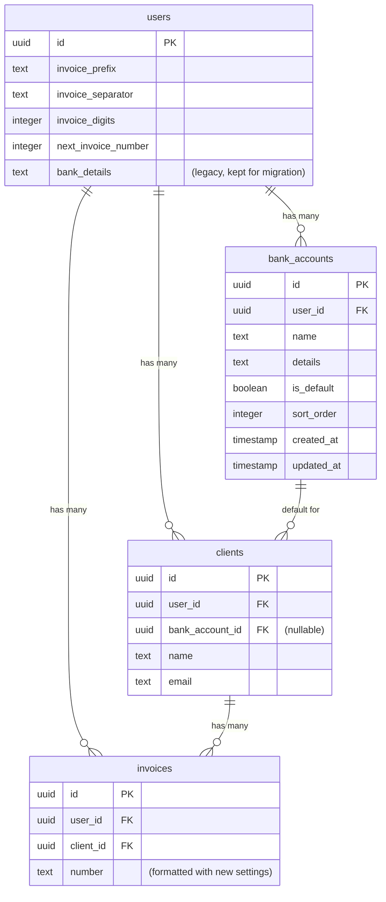

# Configurable Invoice Numbering & Multiple Bank Accounts

## Overview

Two complementary settings enhancements designed through the lens of **Kathy Sierra**: make the user feel competent and in control, not the app clever.

1. **Invoice Number Format** -- Let the user define their numbering scheme (prefix, separator, digit count, starting number) with a live preview that eliminates guessing
2. **Multiple Bank Accounts** -- Manage named bank accounts, assign defaults per client, auto-include the right one on invoices

Design principles:
- **Show, don't describe**: Live previews over help text
- **Progressive disclosure**: Hide complexity until it's needed (e.g., bank account selector only appears when there are 2+ accounts)
- **Set once, forget**: Per-client bank account is configured once and applied automatically
- **Reduce anxiety**: Show exactly what will happen before it happens

## Problem Statement

**Invoice numbering**: The current system hardcodes a 4-digit zero-padded format with a dash separator (`nota-0001`). The user's existing numbering scheme uses 7 digits (`0000083`) and they need to continue from their current sequence. They cannot configure the digit count, separator, or starting number.

**Bank accounts**: The current system stores bank details as a single freeform text field on the user profile. The user has multiple bank accounts (EUR and USD) used for different customers and needs to assign the correct one per client, with the right details automatically appearing on invoices.

## Proposed Solution

### Feature 1: Invoice Number Format

Replace the current "Invoice Prefix" input with an **Invoice Numbering** section:

```
Invoice Numbering
┌─────────────────────────────────────────────────────┐
│                                                     │
│  Prefix        Separator    Digits                  │
│  [nota   ]     [ - ▾ ]     [ 7 ▾ ]                 │
│                                                     │
│  Next Number                                        │
│  [ 84       ]                                       │
│                                                     │
│  ┌─────────────────────────────────────────────┐    │
│  │  Preview                                    │    │
│  │  Your next invoice: nota-0000084             │    │
│  │  Then: nota-0000085, nota-0000086             │    │
│  └─────────────────────────────────────────────┘    │
│                                                     │
│  Last issued: nota-0000083                           │
│                                                     │
└─────────────────────────────────────────────────────┘
```

**Fields:**
- **Prefix** (text, optional): Can be empty for numbers-only (`0000084`)
- **Separator** (select): `-`, `/`, `.`, or none. Hidden when prefix is empty
- **Digits** (select, 3-10): Zero-padding width. Numbers that exceed this naturally overflow (no truncation)
- **Next Number** (integer): The counter for the next invoice. Shown alongside "Last issued" for context

**Live preview** updates instantly as the user changes any field. Shows the next 3 numbers.

**Format logic**: `{prefix}{separator}{padStart(number, digits, '0')}`
When prefix is empty, separator is omitted regardless of selection.

### Feature 2: Multiple Bank Accounts

Replace the current "Bank Details" textarea with a **Bank Accounts** section:

```
Bank Accounts
┌─────────────────────────────────────────────────────┐
│                                                     │
│  ┌───────────────────────────────────────────────┐  │
│  │ Wise EUR                          ★ Default   │  │
│  │ IBAN: ES12 3456 7890 1234 5678 90             │  │
│  │ BIC: TRWIBEB1XXX                  [Edit] [✕]  │  │
│  └───────────────────────────────────────────────┘  │
│                                                     │
│  ┌───────────────────────────────────────────────┐  │
│  │ Mercury USD                                   │  │
│  │ Account: 5074574548373...         [Edit] [✕]  │  │
│  └───────────────────────────────────────────────┘  │
│                                                     │
│  [ + Add Bank Account ]                             │  │
│                                                     │
└─────────────────────────────────────────────────────┘
```

**Bank account fields:**
- **Name** (required): Internal label, e.g., "Wise EUR", "Mercury USD"
- **Details** (required, freeform text): IBAN, BIC, routing number -- whatever the user needs. Same freeform approach as current, but per-account
- **Default** toggle: Exactly one account is the system default

**Client assignment** (only visible when 2+ bank accounts exist):

```
Client Detail Page
┌─────────────────────────────────────────────────────┐
│  Bank Account                                       │
│  [ Wise EUR (default) ▾ ]                           │
│                                                     │
│  Options:                                           │
│  • Wise EUR (default)                               │
│  • Mercury USD                                      │
└─────────────────────────────────────────────────────┘
```

**Invoice flow:**
1. Invoice created for client -> uses client's assigned bank account
2. Client has no assignment -> uses system default bank account
3. Bank details rendered in PDF footer (same position as current)
4. Account name is NOT shown on invoice -- only the bank details text

## Technical Approach

### Database Schema Changes

**Single migration** adding all new schema:

```sql
-- 1. New columns on users table
ALTER TABLE users ADD COLUMN invoice_separator text NOT NULL DEFAULT '-';
ALTER TABLE users ADD COLUMN invoice_digits integer NOT NULL DEFAULT 4;

-- 2. New bank_accounts table
CREATE TABLE bank_accounts (
  id uuid PRIMARY KEY DEFAULT gen_random_uuid(),
  user_id uuid NOT NULL REFERENCES users(id),
  name text NOT NULL,
  details text NOT NULL,
  is_default boolean NOT NULL DEFAULT false,
  sort_order integer NOT NULL DEFAULT 0,
  created_at timestamp DEFAULT now() NOT NULL,
  updated_at timestamp DEFAULT now() NOT NULL
);

-- 3. New FK on clients
ALTER TABLE clients ADD COLUMN bank_account_id uuid REFERENCES bank_accounts(id) ON DELETE SET NULL;

-- 4. Data migration: move existing bankDetails to bank_accounts
INSERT INTO bank_accounts (user_id, name, details, is_default)
SELECT id, 'Primary', bank_details, true FROM users WHERE bank_details IS NOT NULL AND bank_details != '';
```

**Drizzle schema additions** in `apps/web/src/lib/db/schema.ts`:

```typescript
// On users table - add:
invoiceSeparator: text("invoice_separator").notNull().default("-"),
invoiceDigits: integer("invoice_digits").notNull().default(4),

// New table:
export const bankAccounts = pgTable("bank_accounts", {
  id: uuid().primaryKey().defaultRandom(),
  userId: uuid("user_id").notNull().references(() => users.id),
  name: text().notNull(),
  details: text().notNull(),
  isDefault: boolean("is_default").notNull().default(false),
  sortOrder: integer("sort_order").notNull().default(0),
  createdAt: timestamp("created_at").defaultNow().notNull(),
  updatedAt: timestamp("updated_at").defaultNow().notNull(),
});

// On clients table - add:
bankAccountId: uuid("bank_account_id").references(() => bankAccounts.id, { onDelete: "set null" }),
```

### Key Implementation Files

| File | Changes |
|------|---------|
| `apps/web/src/lib/db/schema.ts` | Add `invoiceSeparator`, `invoiceDigits` to users; new `bankAccounts` table; add `bankAccountId` to clients |
| `apps/web/src/actions/settings.ts` | Accept new invoice format fields; new CRUD actions for bank accounts |
| `apps/web/src/actions/invoices.ts` | Extract `formatInvoiceNumber()` utility; use new format fields; resolve bank account for PDF |
| `apps/web/src/actions/clients.ts` | Accept `bankAccountId` on create/update |
| `apps/web/src/components/settings-form.tsx` | Invoice numbering section with live preview; bank accounts CRUD list |
| `apps/web/src/components/client-form.tsx` | Bank account selector dropdown (conditional on 2+ accounts) |
| `apps/web/src/components/client-detail.tsx` | Show assigned bank account; bank account selector in edit mode |
| `apps/web/src/components/invoice-pdf.tsx` | Accept bank details from resolved bank account instead of `business.bankDetails` |
| `apps/web/src/app/api/invoices/[id]/pdf/route.ts` | Resolve bank account when generating PDF |

### Invoice Number Generation (Extracted Utility)

Create `apps/web/src/lib/invoice-number.ts`:

```typescript
export function formatInvoiceNumber(opts: {
  prefix: string;
  separator: string;
  digits: number;
  number: number;
}): string {
  const paddedNumber = String(opts.number).padStart(opts.digits, "0");
  if (!opts.prefix) return paddedNumber;
  return `${opts.prefix}${opts.separator}${paddedNumber}`;
}
```

Used in both `createInvoice` and `duplicateInvoice` (replacing the inline logic at lines ~87 and ~362 of `apps/web/src/actions/invoices.ts`).

### Bank Account Resolution Order

When generating an invoice PDF:
1. Check invoice's client -> `clients.bankAccountId`
2. If null, find the user's default bank account (`bank_accounts.is_default = true`)
3. If no default exists, omit bank details from footer

### Separator Validation

Separator is restricted to: `-`, `/`, `.`, or empty string (select dropdown, not free text). This prevents characters that break PDF filenames or email headers. The invoice number is used as the PDF filename (`${invoice.number}.pdf`), so `/` in the separator would need to be replaced with `-` in filenames.

## Acceptance Criteria

### Invoice Number Format
- [x] Settings page shows Prefix, Separator (select), Digits (select 3-10), and Next Number fields
- [x] Live preview updates instantly showing next 3 invoice numbers
- [x] "Last issued" number shown for context
- [x] Separator field hidden when prefix is empty
- [x] Empty prefix produces numbers like `0000084` (no leading separator)
- [x] Number overflow handled gracefully (5 digits configured, counter at 100000 -> `100000` not truncated)
- [x] Existing invoices unaffected; only new invoices use the new format
- [x] Both `createInvoice` and `duplicateInvoice` use the shared `formatInvoiceNumber` utility
- [x] Migration defaults preserve current behavior (separator: `-`, digits: `4`)

### Bank Accounts
- [x] Settings page shows bank accounts as a list with name, details preview, default badge
- [x] Can add, edit, and delete bank accounts
- [x] Exactly one account is always marked as default
- [x] Cannot delete the default account without first setting another as default
- [x] Deleting a non-default account sets any client references to null (ON DELETE SET NULL)
- [x] Client form/detail shows bank account dropdown only when 2+ accounts exist
- [x] New invoices use client's assigned bank account, falling back to system default
- [x] Invoice PDF footer shows bank details from the resolved bank account
- [x] Migration creates a "Primary" bank account from existing `bankDetails` text, marked as default
- [x] Account name is NOT shown on the invoice PDF -- only the bank details text

## Implementation Phases

### Phase 1: Schema & Migration
- Add columns to users and clients tables
- Create bank_accounts table
- Write data migration for existing bankDetails
- Generate Drizzle migration with `drizzle-kit generate`

### Phase 2: Invoice Number Format
- Extract `formatInvoiceNumber` utility
- Update `createInvoice` and `duplicateInvoice`
- Add new fields to settings form with live preview
- Update settings server action

### Phase 3: Bank Accounts CRUD
- Server actions: `createBankAccount`, `updateBankAccount`, `deleteBankAccount`
- Bank accounts management UI in settings (list, add dialog, edit, delete)
- Default account toggle logic (ensure exactly one default)

### Phase 4: Client Bank Account Assignment
- Add bank account dropdown to client form and detail page
- Update client server actions to persist `bankAccountId`
- Conditional rendering (only when 2+ accounts exist)

### Phase 5: Invoice Integration
- Update PDF generation to resolve bank account per invoice
- Update `sendInvoice` to pass resolved bank details
- Update PDF download API route
- Test full flow: create client with bank account -> create invoice -> verify PDF shows correct bank details

## Edge Cases & Risks

- **Spanish tax compliance**: Sequential numbering must not have gaps. Current `deleteInvoice` does a hard delete with no status check -- out of scope for this plan but flagged as a compliance risk worth addressing separately
- **Format change mid-year**: Allowed. Only affects new invoices. Could show a one-time warning: "You have existing invoices with a different format. This change only affects new invoices."
- **Next number collision**: If user sets next number to a value that would produce a duplicate invoice number, the transaction will fail on the UNIQUE constraint. The error should be caught and shown as "This invoice number already exists. Please choose a higher number."
- **PDF filename with `/` separator**: Replace `/` with `-` in the `Content-Disposition` filename header

## ERD



## References

- Current schema: `apps/web/src/lib/db/schema.ts`
- Invoice number generation: `apps/web/src/actions/invoices.ts:87` and `:362`
- Settings form: `apps/web/src/components/settings-form.tsx`
- Settings action: `apps/web/src/actions/settings.ts`
- Client form: `apps/web/src/components/client-form.tsx`
- Client detail: `apps/web/src/components/client-detail.tsx`
- Invoice PDF: `apps/web/src/components/invoice-pdf.tsx:393-403`
- PDF download route: `apps/web/src/app/api/invoices/[id]/pdf/route.ts`
- Send invoice: `apps/web/src/actions/invoices.ts:179-291`
